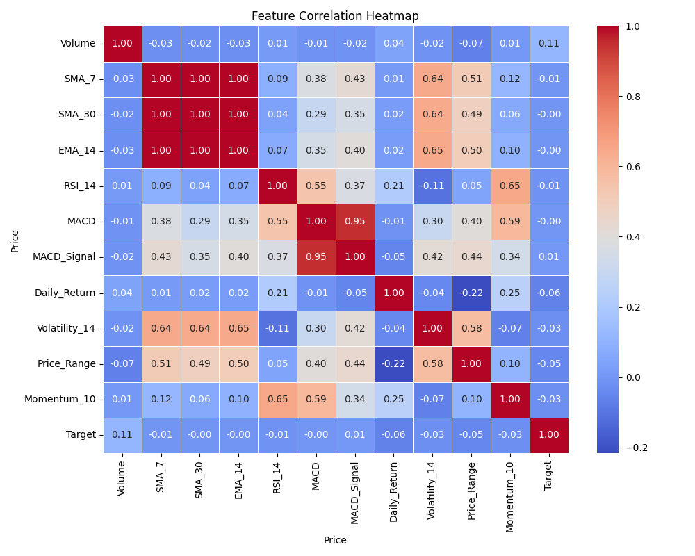
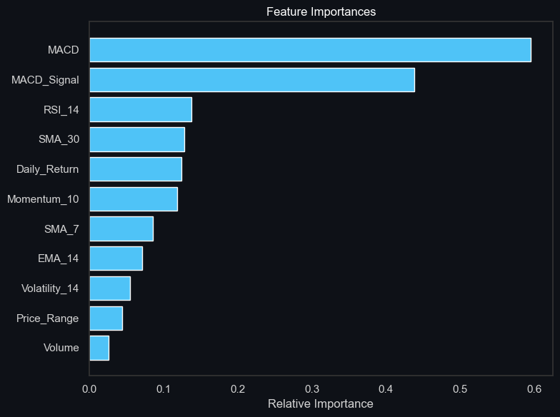
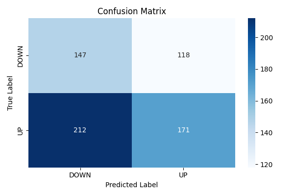

# 🥇 Gold Trend Classification System

> A Professional Machine Learning project that predicts daily Gold Futures movements using technical indicators. Built with Python, Scikit-Learn, and Streamlit.


---
## 🖼️ Visualizations

| Correlation Heatmap | Feature Importance | Confusion Matrix |
|---|---|---|
|  |  |  |

---

## ⚡ Key Results

- 🎯 **Accuracy:** 49.07% (Standard for highly noisy financial assets)
- 🌲 **Best Model:** Logistic Regression
- 🔥 **Top Features:** Volatility, RSI, Price Momentum
- ⚖️ **Dataset Size:** 2,347 filtered samples (from 3,700+ raw rows)

---

## 🚀 Live Demo

Try the interactive prediction app here:  
👉 Coming Soon!

---

## 📌 Project Overview

This project uses historical financial market data to predict whether Gold Futures (`GC=F`) will move **UP** or **DOWN** on the next trading day based on engineered technical indicators (RSI, MACD, SMA, etc.).

The goal is to demonstrate a clean, end-to-end Quantitative Machine Learning workflow — emphasizing strict prevention of data leakage, look-ahead bias, and time-series integrity.

---

## 🌍 Real-World Impact

This model demonstrates how quantitative machine learning can support:
- Algorithmic trading signal generation
- Reduction of emotional/manual market analysis
- Data-driven risk management in commodity portfolios

---

## 📈 Pipeline Execution & Results

Running the full pipeline produces a comprehensive output across data processing, model training, evaluation, and live predictions. Below is the detailed breakdown of the project outcomes:

### 1. Data Preprocessing (`src/preprocess.py`)
- **Data Engineering**: Automatically fetches 15 years of `GC=F` data, applying mathematical indicators to the continuous dataset. Saves the raw output to `data/raw/gold_raw_data.csv`.
- **Label Engineering**: Removes **1,353 NEUTRAL rows** where the market moved sideways, saving the finalized, fully-featured DataFrame to `data/processed/gold_processed_data.csv`.
- **Data Splitting & Scaling**: This pipeline is completely file-based. The downstream training script reads the processed CSV and strictly splits the dataset chronologically into an 80% training set and a 20% test set.

### 2. Model Training (`src/train.py`)
- The script evaluates the performance of multiple classifiers for financial forecasting:
  - **Random Forest Classifier**: Achieved an accuracy of **~45.52%**.
  - **XGBoost Classifier**: Achieved an accuracy of **~47.69%**.
  - **Logistic Regression**: Achieved the highest accuracy of **~49.07%** ✅.
- **Model Serialization**: Logistic Regression is chosen as the final model due to its robustness against overfitting noisy financial data compared to complex tree models. The finalized model and scaler are saved into the `models/` directory.

### 3. Model Evaluation (`src/evaluate.py`)
- Outputs a detailed **Classification Report** emphasizing model performance:
  - **Overall Accuracy:** 49.07%
  - **ROC-AUC Score:** 0.5046
  - *Note: Financial forecasting is inherently noisy. An accuracy hovering around 50% is standard for raw daily directional predictions on mature assets like Gold.*
- Automatically renders and saves crucial analytical graphics into the `images/` directory:
  - 🌡️ **Correlation Heatmap:** Maps relationships between technical indicators and the target variable.
  - 📋 **Confusion Matrix:** Illustrates the raw count of True Positives/Negatives vs. False Predictions.
  - 📊 **Feature Importance:** Highlights the absolute coefficients, showing which indicators drive the Logistic Regression's decisions.

### 4. Interactive Predictions (`src/predict.py` & `app.py`)
- **CLI Predictions:** Validates the latest market data against the loaded `.pkl` model and calculates confidence percentages.
- **Streamlit Web Dashboard:** Running `streamlit run app.py` launches a responsive, cleanly styled dashboard. It plots interactive Plotly candlestick charts with SMAs and RSI, automatically evaluating the most recent *closed* trading session to display real-time UP/DOWN predictions.

---

### 🎯 What This Project Covers
- Financial data ingestion via `yfinance`
- Technical Indicator Engineering (SMA, EMA, RSI, MACD, Volatility)
- Binary classification (UP / DOWN) with threshold filtering
- Model comparison: Logistic Regression, Random Forest, XGBoost
- Model evaluation with accuracy, ROC-AUC, and classification report
- Saved model deployment via an interactive Streamlit dashboard

---

## 📊 Dataset Overview & Context

This project uses public **Yahoo Finance** data, tracking the daily closing prices and volumes of Gold Futures.

- **Source:** [Yahoo Finance — Gold Futures (GC=F)](https://finance.yahoo.com/quote/GC=F/)
- **Data Volume:** Combines **3,700+ rows** of raw trading data over 15 years, filtered down into the final dataset.
- **Data Integrity:** Saved locally as `gold_raw_data.csv` and `gold_processed_data.csv` after dynamic downloading.

Here is the dictionary of engineered technical features predicting the final movement:

| Feature | Description |
|---|---|
| `Volume` | Daily trading volume of Gold Futures |
| `SMA_7` | 7-day Simple Moving Average |
| `SMA_30` | 30-day Simple Moving Average |
| `EMA_14` | 14-day Exponential Moving Average |
| `RSI_14` | Relative Strength Index (Momentum) |
| `MACD` | Moving Average Convergence Divergence |
| `MACD_Signal` | Signal line for MACD |
| `Daily_Return` | Percentage change in daily close |
| `Volatility_14` | Rolling 14-day standard deviation of returns |
| `Price_Range` | Intraday volatility (High - Low) |
| `Momentum_10` | 10-day absolute price momentum |

**Label Engineering:** Next Day Return > +0.3% → `UP (1)`, Return < -0.3% → `DOWN (0)`. 
*(Note: Returns between -0.3% and +0.3% are dropped to reduce market noise; exactly **1,353 NEUTRAL rows** were filtered during processing).*

---

## ⚙️ Setup & Installation

### 1. Clone the Repository
```bash
git clone https://github.com/rapfii/gold-trend-classification
cd gold-trend-classification
```

### 2. Create a Virtual Environment *(Recommended)*
```bash
# Windows
python -m venv venv
venv\Scripts\activate

# macOS / Linux
python3 -m venv venv
source venv/bin/activate
```

### 3. Install Dependencies
```bash
pip install -r requirements.txt
```

---

## 🚀 How to Run

### Option A — Run the Full ML Pipeline
```bash
# Step 1: Download and Preprocess data
python -m src.preprocess

# Step 2: Train models & save the best
python -m src.train

# Step 3: Evaluate models & generate charts
python -m src.evaluate

# Step 4: Make a real-time prediction
python -m src.predict
```

### Option B — Explore the Notebook
```bash
jupyter notebook notebooks/gold_trend_analysis.ipynb
```

### Option C — Launch the Web App
```bash
streamlit run app.py
```
Then open your browser at: `http://localhost:8501`

---

## 🧠 ML Workflow

```
Raw Yahoo Data → Continuous Indicator Math → Target Shifting
    → NEUTRAL Filtering → Chronological Split → Leakage-Free Scaling
    → Model Training → Evaluation → Deployment
```

---

## 🗂️ Project Structure

```
gold-trend-classification/
│
├── data/
│   ├── raw/                         
│   │   └── gold_raw_data.csv        ← Raw downloaded dataset
│   └── processed/                   
│       └── gold_processed_data.csv  ← Filtered and engineered dataset
│
├── notebooks/
│   └── gold_trend_analysis.ipynb    ← Interactive EDA and ML walkthrough
│
├── src/
│   ├── indicators.py                ← Technical indicator math formulas
│   ├── preprocess.py                ← Data cleaning, lagging, and scaling
│   ├── train.py                     ← Model training and saving
│   ├── evaluate.py                  ← Metrics, plots, and model evaluation
│   └── predict.py                   ← Predict trend for new market days
│
├── models/
│   ├── gold_trend_model.pkl         ← Saved best-performing model
│   └── scaler.pkl                   ← Saved StandardScaler instance
│
├── images/
│   ├── heatmap.png                  ← Feature correlation heatmap
│   ├── confusion_matrix.png         ← Confusion matrix visualization
│   └── feature_importance.png       ← Feature importance/coefficients
│
├── app.py                           ← Streamlit prediction web app
├── requirements.txt                 ← Python dependencies
└── README.md                        ← Project documentation (you're here!)
```

---

## 🛠️ Technologies Used

| Tool | Purpose |
|---|---|
| `yfinance` | Live market data ingestion |
| `pandas` | Data engineering and manipulation |
| `matplotlib` + `seaborn` | Static data visualization |
| `plotly` | Interactive web charts |
| `scikit-learn` + `xgboost`| ML models, scaling, evaluation |
| `streamlit` | Interactive dashboard deployment |

---

## 📄 License

This project is licensed under the **MIT License** — feel free to use, modify, and share.

---

## 🙋 Author

**Rapfi**
- GitHub: https://github.com/rapfii
- LinkedIn: https://www.linkedin.com/in/raffi-khairan-hidayat

---

> ⭐ If you found this project helpful, consider giving it a star!
